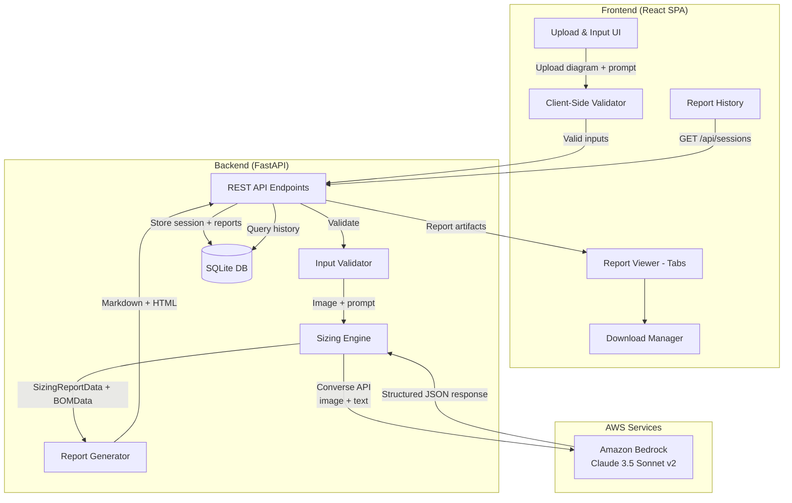

# Design Document: AWS Infrastructure Sizing Tool

## Overview

The AWS Infrastructure Sizing Tool is a web application that enables cloud architects to upload architecture diagrams and provide non-functional requirements (NFRs) / volumetric details, then uses a multimodal AI model to generate detailed AWS infrastructure sizing recommendations and a Bill of Materials (BOM) with cost estimates. The tool produces three output artifacts: a Sizing Report (Markdown), a BOM document (Markdown), and a combined HTML report with professional styling, navigation, and summary cards.

The system follows a client-server architecture with a React-based single-page application (SPA) frontend and a Python FastAPI backend. The backend orchestrates AI analysis via Amazon Bedrock's multimodal Claude model, transforms the AI output into a structured intermediate JSON format, and renders that JSON into Markdown and HTML reports. All report data flows through a well-defined JSON intermediate representation, enabling round-trip serialization/deserialization and consistent rendering across output formats. A SQLite database stores session history, generated reports, and configuration, enabling users to revisit past analyses.

### Key Design Decisions

1. **Python FastAPI backend** — chosen for its async support, fast development, strong typing with Pydantic, and excellent ecosystem for AI/LLM integration (boto3 for Bedrock).
2. **React + TypeScript frontend** — provides a rich SPA experience with tabbed report viewing, file upload with preview, and client-side validation.
3. **Amazon Bedrock (Claude 3.5 Sonnet v2)** — multimodal foundation model accessed via the Bedrock `InvokeModel` / `Converse` API. Keeps all AI calls within AWS, no external API keys needed — uses IAM credentials. Supports image + text input for architecture diagram analysis.
4. **SQLite database** — lightweight, zero-config, file-based database for storing session history, generated reports, and app configuration. No separate database server needed. Uses `aiosqlite` for async access from FastAPI.
5. **Structured JSON intermediate format** — all report data passes through a typed JSON schema before rendering to Markdown or HTML. This enables the round-trip property (Requirement 10) and decouples AI output parsing from report formatting.
6. **Client-side ZIP bundling** — uses JSZip in the browser to bundle downloads, avoiding server-side file system management.

## Configuration

The backend uses a layered configuration approach: defaults → config file (`config.yaml`) → environment variables (highest priority).

### Configuration File (`config.yaml`)

```yaml
# AWS Bedrock Configuration
bedrock:
  region: "us-east-1"                          # AWS region for Bedrock API
  model_id: "anthropic.claude-3-5-sonnet-20241022-v2:0"  # Bedrock model ID
  max_tokens: 16384                            # Max output tokens from LLM
  temperature: 0.2                             # Low temperature for deterministic sizing
  timeout_seconds: 120                         # Bedrock API call timeout
  retry_attempts: 2                            # Number of retries on failure
  retry_backoff_base: 1.0                      # Exponential backoff base (seconds)

# AWS Credentials (optional — defaults to boto3 credential chain)
aws:
  profile_name: null                           # AWS CLI profile name (optional)
  access_key_id: null                          # Override via env: AWS_ACCESS_KEY_ID
  secret_access_key: null                      # Override via env: AWS_SECRET_ACCESS_KEY
  session_token: null                          # Override via env: AWS_SESSION_TOKEN

# Application Settings
app:
  host: "0.0.0.0"
  port: 8000
  cors_origins: ["http://localhost:5173"]       # Frontend dev server
  max_upload_size_mb: 20
  supported_image_formats: ["png", "jpg", "jpeg", "webp"]
  default_pricing_region: "us-east-1"

# Database
database:
  path: "data/sizing_tool.db"                  # SQLite database file path
  echo_sql: false                              # Log SQL queries (debug)

# Report Generation
report:
  html_template: "templates/report.html"       # Jinja2 HTML template path
  branding:
    company_name: "AWS Infrastructure Sizing Tool"
    accent_color: "#A100FF"
  max_history: 50                              # Max reports stored in history

# Logging
logging:
  level: "INFO"                                # DEBUG | INFO | WARNING | ERROR
  format: "json"                               # json | text
```

### Environment Variable Overrides

| Environment Variable | Config Path | Description |
|---|---|---|
| `AWS_DEFAULT_REGION` | `bedrock.region` | AWS region for Bedrock |
| `AWS_ACCESS_KEY_ID` | `aws.access_key_id` | AWS access key |
| `AWS_SECRET_ACCESS_KEY` | `aws.secret_access_key` | AWS secret key |
| `AWS_SESSION_TOKEN` | `aws.session_token` | AWS session token |
| `AWS_PROFILE` | `aws.profile_name` | AWS CLI profile |
| `BEDROCK_MODEL_ID` | `bedrock.model_id` | Override Bedrock model |
| `BEDROCK_MAX_TOKENS` | `bedrock.max_tokens` | Override max tokens |
| `APP_PORT` | `app.port` | Server port |
| `APP_CORS_ORIGINS` | `app.cors_origins` | Comma-separated CORS origins |
| `DATABASE_PATH` | `database.path` | SQLite file path |
| `LOG_LEVEL` | `logging.level` | Log level |

### Configuration Loading (Python)

```python
from pydantic_settings import BaseSettings
from pydantic import Field
import yaml

class BedrockConfig(BaseSettings):
    region: str = "us-east-1"
    model_id: str = "anthropic.claude-3-5-sonnet-20241022-v2:0"
    max_tokens: int = 16384
    temperature: float = 0.2
    timeout_seconds: int = 120
    retry_attempts: int = 2
    retry_backoff_base: float = 1.0

class DatabaseConfig(BaseSettings):
    path: str = "data/sizing_tool.db"
    echo_sql: bool = False

class AppConfig(BaseSettings):
    host: str = "0.0.0.0"
    port: int = 8000
    cors_origins: list[str] = ["http://localhost:5173"]
    max_upload_size_mb: int = 20
    supported_image_formats: list[str] = ["png", "jpg", "jpeg", "webp"]
    default_pricing_region: str = "us-east-1"

class Settings(BaseSettings):
    bedrock: BedrockConfig = BedrockConfig()
    database: DatabaseConfig = DatabaseConfig()
    app: AppConfig = AppConfig()
```

## Architecture



### Request Flow

1. User uploads an architecture diagram (optional) and enters NFR/volumetric text (optional, but at least one required)
2. Frontend validates inputs client-side (file type, size, at least one input present)
3. Frontend sends `POST /api/analyze` with multipart form data (image file + text prompt)
4. Backend validates inputs server-side
5. Sizing Engine sends the image (base64-encoded) and text prompt to Amazon Bedrock's Claude model via the Converse API with a structured output prompt
6. Bedrock returns a JSON response conforming to the `SizingReportData` and `BOMData` schemas
7. Report Generator serializes the data to the JSON intermediate format, then renders Markdown and HTML
8. Backend stores the session and generated reports in SQLite
9. Backend returns all three artifacts (sizing MD, BOM MD, HTML) plus the raw JSON to the frontend
10. Frontend displays reports in tabbed view and enables downloads

## Components and Interfaces

### Frontend Components

| Component | Responsibility |
|---|---|
| `UploadPanel` | Drag-and-drop or click-to-upload for architecture diagram images. Shows preview, file info, remove/replace button. Validates file type (PNG/JPG/JPEG/WEBP) and size (≤20MB) client-side. |
| `PromptInput` | Textarea for NFR/volumetric text input. Preserves content during session. |
| `SubmitButton` | Triggers analysis. Disabled during processing. Validates at least one input is present. |
| `ProgressIndicator` | Shows spinner/progress bar during AI analysis. Transitions to results on completion, shows error on failure. |
| `ReportViewer` | Tabbed container with three tabs: Sizing Report, BOM, HTML Report. Renders Markdown with formatted tables and code blocks. HTML tab uses an iframe or `dangerouslySetInnerHTML`. |
| `DownloadManager` | Individual download buttons per artifact + "Download All" ZIP button. Filenames include generation date. |
| `SessionHistory` | Sidebar or drawer listing past analysis sessions. Shows date, prompt snippet, region. Click to reload a past report. |

### Backend Components

| Component | Responsibility |
|---|---|
| `POST /api/analyze` | Main endpoint. Accepts multipart form: `diagram` (file, optional), `prompt` (text, optional), `region` (text, default "us-east-1"). Returns JSON with all report artifacts. Stores session in SQLite. |
| `GET /api/sessions` | Returns list of past analysis sessions (id, date, prompt snippet, region, status). Paginated. |
| `GET /api/sessions/{id}` | Returns full report artifacts for a past session. |
| `DELETE /api/sessions/{id}` | Deletes a session and its reports from the database. |
| `InputValidator` | Server-side validation: file type via magic bytes, file size, at least one input present. Returns 400 with descriptive errors. |
| `SizingEngine` | Constructs the Bedrock Converse API request with system instructions, user prompt, and base64 image. Parses response into `SizingReportData` and `BOMData` Pydantic models. Retries on parse failure (up to 2 retries). |
| `BedrockClient` | Wrapper around `boto3` Bedrock Runtime client. Handles the `Converse` API call with image + text content blocks, timeout, retries with exponential backoff, and credential resolution via the standard boto3 chain (env vars → config file → IAM role). |
| `ReportGenerator` | Converts `SizingReportData` → Sizing Markdown, `BOMData` → BOM Markdown, both → combined HTML report (via Jinja2 template). Also handles JSON serialization/deserialization for the intermediate format. |
| `PromptBuilder` | Constructs the system prompt and user message for Bedrock. The system prompt includes detailed instructions on the expected output structure, AWS pricing knowledge, and example output sections. |
| `DatabaseManager` | Manages SQLite connection via `aiosqlite`. Handles schema creation, session CRUD, and report storage/retrieval. |

### API Interface

```
POST /api/analyze
  Content-Type: multipart/form-data
  Body:
    diagram: File (optional, PNG/JPG/JPEG/WEBP, ≤20MB)
    prompt: string (optional, NFR/volumetric text)
    region: string (optional, default "us-east-1")

  Response 200:
    {
      "session_id": "string (UUID)",
      "sizing_report_md": "string (Markdown)",
      "bom_md": "string (Markdown)",
      "html_report": "string (HTML)",
      "report_data_json": "string (JSON intermediate format)",
      "generated_at": "ISO 8601 timestamp"
    }

  Response 400: { "error": "string", "details": [...] }
  Response 422: { "error": "string" }  // LLM parse failure after retries
  Response 500: { "error": "string" }  // Bedrock API failure

GET /api/sessions?page=1&per_page=20
  Response 200:
    {
      "sessions": [
        {
          "id": "UUID",
          "created_at": "ISO 8601",
          "prompt_snippet": "string (first 100 chars)",
          "region": "string",
          "had_diagram": true,
          "total_monthly_cost": 1538.93
        }
      ],
      "total": 42,
      "page": 1,
      "per_page": 20
    }

GET /api/sessions/{id}
  Response 200: (same shape as POST /api/analyze response)
  Response 404: { "error": "Session not found" }

DELETE /api/sessions/{id}
  Response 204: (no content)
  Response 404: { "error": "Session not found" }
```

### Bedrock Integration

The `BedrockClient` uses the boto3 Bedrock Runtime `converse` API:

```python
import boto3
import base64
from botocore.config import Config

class BedrockClient:
    def __init__(self, settings: BedrockConfig):
        self.client = boto3.client(
            "bedrock-runtime",
            region_name=settings.region,
            config=Config(
                read_timeout=settings.timeout_seconds,
                retries={"max_attempts": settings.retry_attempts, "mode": "adaptive"}
            )
        )
        self.model_id = settings.model_id
        self.max_tokens = settings.max_tokens
        self.temperature = settings.temperature

    def analyze(self, system_prompt: str, user_text: str, image_bytes: bytes | None, image_media_type: str | None) -> str:
        """Send multimodal request to Bedrock and return the text response."""
        content_blocks = []
        if image_bytes and image_media_type:
            content_blocks.append({
                "image": {
                    "format": image_media_type.split("/")[-1],  # "png", "jpeg", "webp"
                    "source": {"bytes": image_bytes}
                }
            })
        content_blocks.append({"text": user_text})

        response = self.client.converse(
            modelId=self.model_id,
            system=[{"text": system_prompt}],
            messages=[{"role": "user", "content": content_blocks}],
            inferenceConfig={
                "maxTokens": self.max_tokens,
                "temperature": self.temperature
            }
        )
        return response["output"]["message"]["content"][0]["text"]
```

### SQLite Database Schema

```sql
-- Sessions table: stores each analysis run
CREATE TABLE IF NOT EXISTS sessions (
    id TEXT PRIMARY KEY,                    -- UUID
    created_at TEXT NOT NULL,               -- ISO 8601 timestamp
    prompt_text TEXT,                       -- User's NFR/volumetric prompt
    region TEXT NOT NULL DEFAULT 'us-east-1',
    had_diagram INTEGER NOT NULL DEFAULT 0, -- boolean: 1 if diagram was uploaded
    diagram_filename TEXT,                  -- Original filename of uploaded diagram
    status TEXT NOT NULL DEFAULT 'pending', -- pending | completed | failed
    error_message TEXT,                     -- Error details if status = failed
    total_monthly_cost REAL,               -- Extracted from BOM for quick display
    bedrock_model_id TEXT,                 -- Model used for this session
    bedrock_latency_ms INTEGER             -- Bedrock API response time
);

-- Reports table: stores generated report artifacts
CREATE TABLE IF NOT EXISTS reports (
    id TEXT PRIMARY KEY,                    -- UUID
    session_id TEXT NOT NULL,               -- FK to sessions
    sizing_report_md TEXT,                  -- Markdown sizing report
    bom_md TEXT,                            -- Markdown BOM
    html_report TEXT,                       -- Combined HTML report
    report_data_json TEXT,                  -- JSON intermediate format
    FOREIGN KEY (session_id) REFERENCES sessions(id) ON DELETE CASCADE
);

-- Index for session listing (most recent first)
CREATE INDEX IF NOT EXISTS idx_sessions_created_at ON sessions(created_at DESC);
```


## Data Models

### SizingReportData (JSON Intermediate Format)

This is the core data model that flows through the system. The LLM outputs data conforming to this schema, the Report Generator serializes/deserializes it, and renderers consume it to produce Markdown and HTML.

```python
from pydantic import BaseModel, Field
from typing import Optional
from datetime import datetime

class NFRSummaryItem(BaseModel):
    requirement: str
    target: str

class ServiceConfig(BaseModel):
    """Configuration for a single AWS service (e.g., CloudFront, ALB, EKS)."""
    service_name: str
    parameters: list[ConfigParameter]

class ConfigParameter(BaseModel):
    parameter: str
    recommendation: str
    rationale: Optional[str] = None

class NodeGroupSpec(BaseModel):
    name: str  # e.g., "web", "batch", "system"
    instance_type: str  # e.g., "c6i.xlarge"
    vcpu: int
    memory_gib: float
    min_nodes: int
    max_nodes: int
    desired_nodes: int
    capacity_type: str  # "on-demand" | "spot"
    disk_size_gib: int
    purpose: str

class PodSpec(BaseModel):
    workload: str  # e.g., "Web App", "Batch – Daily (10K)"
    cpu_request: str  # e.g., "500m"
    cpu_limit: str  # e.g., "1000m"
    memory_request: str  # e.g., "512Mi"
    memory_limit: str  # e.g., "1536Mi"
    min_pods: int
    max_pods: int
    scaling_method: str  # e.g., "HPA (CPU 50%)", "Kubernetes Job"

class HPAConfig(BaseModel):
    target_deployment: str
    min_replicas: int
    max_replicas: int
    cpu_target_percent: int
    scale_up_window_seconds: int
    scale_down_window_seconds: int

class LatencyBudgetItem(BaseModel):
    component: str
    expected_latency: str
    notes: str

class KubernetesManifest(BaseModel):
    """A Kubernetes YAML snippet (Deployment, HPA, Job, Karpenter NodePool)."""
    kind: str  # "Deployment" | "HPA" | "Job" | "NodePool"
    name: str
    yaml_content: str

class BatchJobSpec(BaseModel):
    frequency: str  # "daily" | "monthly" | "quarterly" | "annual"
    record_volume: str
    processing_window: str
    throughput_required: str
    parallelism: int
    pod_cpu_request: str
    pod_cpu_limit: str
    pod_memory_request: str
    pod_memory_limit: str

class CostOptimizationStrategy(BaseModel):
    strategy: str
    savings_potential: str
    applicable_to: str

class SizingReportData(BaseModel):
    """Top-level sizing report data model."""
    title: str = "AWS Infrastructure Sizing Recommendations"
    generated_at: datetime
    region: str = "us-east-1"
    nfr_summary: list[NFRSummaryItem]
    service_configs: list[ServiceConfig]
    node_groups: list[NodeGroupSpec]
    pod_specs: list[PodSpec]
    hpa_configs: list[HPAConfig]
    latency_budget: list[LatencyBudgetItem]
    kubernetes_manifests: list[KubernetesManifest]
    batch_jobs: list[BatchJobSpec]
    cost_optimization: list[CostOptimizationStrategy]
    container_best_practices: list[ConfigParameter]
    network_config: list[ConfigParameter]
    monitoring_metrics: list[MonitoringMetric]

class MonitoringMetric(BaseModel):
    metric: str
    target: str
    action_if_exceeded: str
```

### BOMData (JSON Intermediate Format)

```python
class BOMLineItem(BaseModel):
    line_item: str
    specification: str
    quantity: str
    unit_price: str
    monthly_estimate: float

class BOMTier(BaseModel):
    tier_name: str  # e.g., "Web Application Tier"
    tier_number: int
    sections: list[BOMSection]
    subtotal: float

class BOMSection(BaseModel):
    section_name: str  # e.g., "Amazon CloudFront (CDN)"
    section_number: str  # e.g., "1.1"
    line_items: list[BOMLineItem]
    subtotal: float

class CostSummaryItem(BaseModel):
    category: str
    monthly_estimate: float

class SavingsPlanScenario(BaseModel):
    scenario: str
    monthly_estimate: str
    annual_estimate: str
    savings_vs_on_demand: str

class BOMServiceSummary(BaseModel):
    number: int
    service: str
    purpose: str
    specification: str

class BOMData(BaseModel):
    """Top-level BOM data model."""
    title: str = "AWS Infrastructure – Bill of Materials (BOM)"
    generated_at: datetime
    region: str = "us-east-1"
    pricing_type: str = "On-Demand (USD)"
    tiers: list[BOMTier]
    cost_summary: list[CostSummaryItem]
    total_monthly: float
    total_annual: float
    savings_plans: list[SavingsPlanScenario]
    service_summary: list[BOMServiceSummary]
    notes: list[str]
```

### Combined Report Envelope

```python
class ReportEnvelope(BaseModel):
    """The complete JSON intermediate format wrapping both reports."""
    sizing_report: SizingReportData
    bom: BOMData
    metadata: ReportMetadata

class ReportMetadata(BaseModel):
    generated_at: datetime
    region: str
    tool_version: str
    llm_model: str  # e.g., "anthropic.claude-3-5-sonnet-20241022-v2:0"
    bedrock_latency_ms: int
    input_had_diagram: bool
    input_had_prompt: bool
```

### Serialization / Deserialization

The `ReportGenerator` provides two key methods:

```python
class ReportGenerator:
    def serialize(self, envelope: ReportEnvelope) -> str:
        """Serialize ReportEnvelope to JSON string."""
        return envelope.model_dump_json(indent=2)

    def deserialize(self, json_str: str) -> ReportEnvelope:
        """Parse JSON string back into ReportEnvelope."""
        return ReportEnvelope.model_validate_json(json_str)

    def render_sizing_markdown(self, data: SizingReportData) -> str:
        """Render SizingReportData to Markdown string."""
        ...

    def render_bom_markdown(self, data: BOMData) -> str:
        """Render BOMData to Markdown string."""
        ...

    def render_html_report(self, sizing: SizingReportData, bom: BOMData) -> str:
        """Render combined HTML report with TOC, styling, summary cards."""
        ...
```


## Correctness Properties

*A property is a characteristic or behavior that should hold true across all valid executions of a system — essentially, a formal statement about what the system should do. Properties serve as the bridge between human-readable specifications and machine-verifiable correctness guarantees.*

### Property 1: File type validation is exact

*For any* file with a given extension/MIME type, the Input_Validator accepts it if and only if the format is one of PNG, JPG, JPEG, or WEBP. All other formats must be rejected.

**Validates: Requirements 1.1, 1.4**

### Property 2: File size validation rejects oversized files

*For any* file with a given size in bytes, the Input_Validator rejects it if and only if the size exceeds 20 MB (20,971,520 bytes). Files at or below 20 MB must be accepted (assuming valid format).

**Validates: Requirements 1.3**

### Property 3: Input combination validation requires at least one input

*For any* combination of (has_diagram: bool, has_prompt: bool), the Input_Validator accepts the submission if and only if at least one of has_diagram or has_prompt is true. The combination (false, false) must be rejected.

**Validates: Requirements 2.2, 2.3, 9.1**

### Property 4: SizingReportData structural completeness

*For any* valid SizingReportData object, every node group must have non-empty instance_type, vcpu > 0, and memory_gib > 0; every latency budget item must have non-empty component and expected_latency; every batch job must have parallelism ≥ 1 and non-empty pod resource requests/limits; and every HPA config must have min_replicas ≤ max_replicas and cpu_target_percent > 0.

**Validates: Requirements 3.4, 3.5, 3.6, 3.7**

### Property 5: BOMData structural completeness

*For any* valid BOMData object, every line item must have non-empty line_item, specification, quantity, unit_price, and monthly_estimate ≥ 0; every tier must contain at least one section; the savings_plans list must be non-empty; and the service_summary list must be non-empty with each entry having non-empty service, purpose, and specification fields.

**Validates: Requirements 4.1, 4.2, 4.4, 4.5**

### Property 6: BOM cost calculation consistency

*For any* valid BOMData object, the sum of all tier subtotals must equal total_monthly (within floating-point tolerance of 0.01), and total_annual must equal total_monthly × 12 (within tolerance of 0.12). Additionally, each tier's subtotal must equal the sum of its section subtotals.

**Validates: Requirements 4.3**

### Property 7: Sizing Markdown contains all report data

*For any* valid SizingReportData object, the rendered Markdown string must contain: every node group's instance_type, every latency budget item's component name, every batch job's frequency, and every HPA config's target_deployment name.

**Validates: Requirements 5.1, 10.4**

### Property 8: BOM Markdown contains all cost data

*For any* valid BOMData object, the rendered BOM Markdown string must contain: every tier's tier_name, every section's section_name, and the formatted total_monthly value.

**Validates: Requirements 5.2**

### Property 9: HTML report contains both sections with TOC

*For any* valid ReportEnvelope (containing both SizingReportData and BOMData), the rendered HTML string must contain: at least one element with id matching each TOC anchor link, both a sizing section and a BOM section, and the HTML must be well-formed (opening tags have matching closing tags for structural elements).

**Validates: Requirements 5.3, 5.4**

### Property 10: Download filenames include generation date

*For any* generation timestamp, the filename generation function must produce a filename string that contains the date portion (YYYY-MM-DD) of that timestamp.

**Validates: Requirements 6.2**

### Property 11: ZIP bundle contains all report artifacts

*For any* set of three report artifacts (sizing MD, BOM MD, HTML), the ZIP bundling function must produce a ZIP archive containing exactly 3 entries, and each entry's content must match the original artifact content byte-for-byte.

**Validates: Requirements 6.3**

### Property 12: Report data round-trip serialization

*For any* valid ReportEnvelope object, serializing it to JSON and then deserializing the JSON back must produce an object that is equivalent to the original. That is: `deserialize(serialize(envelope)) == envelope`.

**Validates: Requirements 10.1, 10.2, 10.3**

## Error Handling

### Client-Side Errors (Frontend)

| Error Condition | Handling |
|---|---|
| Unsupported file format selected | Immediate rejection with message: "Unsupported format. Please upload PNG, JPG, JPEG, or WEBP." File input is cleared. |
| File exceeds 20 MB | Immediate rejection with message: "File too large. Maximum size is 20 MB." File input is cleared. |
| No inputs provided on submit | Submit button shows validation error: "Please provide at least an architecture diagram or a text prompt." |
| Network error during API call | Progress indicator replaced with error: "Network error. Please check your connection and try again." Retry button shown. |

### Server-Side Errors (Backend)

| Error Condition | HTTP Status | Response |
|---|---|---|
| Invalid file type (magic bytes check) | 400 | `{"error": "Invalid file format", "details": ["Supported formats: PNG, JPG, JPEG, WEBP"]}` |
| File too large | 400 | `{"error": "File too large", "details": ["Maximum file size: 20 MB"]}` |
| No inputs provided | 400 | `{"error": "No input provided", "details": ["Provide at least a diagram or text prompt"]}` |
| Corrupted/unreadable image | 400 | `{"error": "File could not be processed", "details": ["The uploaded file appears to be corrupted"]}` |
| LLM API timeout | 504 | `{"error": "Analysis timed out", "details": ["The Bedrock service took too long to respond. Please try again."]}` |
| LLM API error (rate limit, auth) | 502 | `{"error": "Bedrock service unavailable", "details": ["..."]}` |
| LLM response parse failure (after retries) | 422 | `{"error": "Could not generate report", "details": ["The AI response could not be parsed into a valid report. Please try rephrasing your prompt."]}` |
| Unrecognizable diagram (LLM reports) | 422 | `{"error": "Diagram analysis incomplete", "details": ["Could not interpret: [specific parts]"]}` |
| Internal server error | 500 | `{"error": "Internal error", "details": ["An unexpected error occurred"]}` |

### Retry Strategy

- Bedrock API calls: up to 2 retries with adaptive backoff (handled by boto3 retry config)
- LLM response parsing: if the response doesn't conform to the Pydantic schema, retry the Bedrock call with a corrective prompt (up to 2 retries)
- No automatic retries for client errors (4xx)
- Failed sessions are stored in SQLite with `status = 'failed'` and `error_message` for debugging

## Testing Strategy

### Unit Tests

Unit tests cover specific examples, edge cases, and integration points:

- **Input validation**: test specific file types (PNG accepted, PDF rejected), exact 20MB boundary, empty inputs
- **BOM cost calculation**: test with known BOM data and verify exact subtotals/totals
- **Markdown rendering**: test with a minimal SizingReportData and verify expected section headers appear
- **HTML rendering**: test that TOC anchor IDs match section IDs in a rendered report
- **Filename generation**: test with specific dates and verify format
- **Error responses**: test each error condition returns the correct HTTP status and message
- **Corrupted file handling**: test with random bytes that aren't valid images (edge case from 9.2)
- **YAML snippet inclusion**: test that Kubernetes manifests appear in rendered Markdown when present (edge case from 5.5)
- **Region default**: test that omitting region defaults to "us-east-1" (example from 4.6)

### Property-Based Tests

Property-based tests verify universal properties across randomly generated inputs. Each property test must:
- Run a minimum of 100 iterations
- Reference its design document property with a tag comment
- Use a property-based testing library (Hypothesis for Python backend, fast-check for TypeScript frontend)

| Property | Test Description | Library | Tag |
|---|---|---|---|
| P1: File type validation | Generate random file extensions/MIME types, verify accept iff supported | fast-check | `Feature: aws-infra-sizing-tool, Property 1: File type validation is exact` |
| P2: File size validation | Generate random file sizes (0 to 100MB), verify reject iff >20MB | fast-check | `Feature: aws-infra-sizing-tool, Property 2: File size validation rejects oversized files` |
| P3: Input combination | Generate all 4 boolean combos of (has_diagram, has_prompt), verify accept iff at least one true | fast-check | `Feature: aws-infra-sizing-tool, Property 3: Input combination validation requires at least one input` |
| P4: SizingReportData structure | Generate random valid SizingReportData, verify all structural invariants | Hypothesis | `Feature: aws-infra-sizing-tool, Property 4: SizingReportData structural completeness` |
| P5: BOMData structure | Generate random valid BOMData, verify all structural invariants | Hypothesis | `Feature: aws-infra-sizing-tool, Property 5: BOMData structural completeness` |
| P6: BOM cost calculation | Generate random BOMData with known line item costs, verify subtotal/total math | Hypothesis | `Feature: aws-infra-sizing-tool, Property 6: BOM cost calculation consistency` |
| P7: Sizing MD content | Generate random SizingReportData, render to MD, verify all key data appears | Hypothesis | `Feature: aws-infra-sizing-tool, Property 7: Sizing Markdown contains all report data` |
| P8: BOM MD content | Generate random BOMData, render to MD, verify tier names and totals appear | Hypothesis | `Feature: aws-infra-sizing-tool, Property 8: BOM Markdown contains all cost data` |
| P9: HTML report structure | Generate random ReportEnvelope, render to HTML, verify TOC + both sections | Hypothesis | `Feature: aws-infra-sizing-tool, Property 9: HTML report contains both sections with TOC` |
| P10: Filename date | Generate random datetimes, verify filename contains YYYY-MM-DD | fast-check | `Feature: aws-infra-sizing-tool, Property 10: Download filenames include generation date` |
| P11: ZIP bundle | Generate random report artifact strings, bundle to ZIP, verify 3 entries with matching content | fast-check | `Feature: aws-infra-sizing-tool, Property 11: ZIP bundle contains all report artifacts` |
| P12: Round-trip serialization | Generate random ReportEnvelope, serialize to JSON, deserialize, verify equality | Hypothesis | `Feature: aws-infra-sizing-tool, Property 12: Report data round-trip serialization` |

### Testing Libraries

- **Backend (Python)**: pytest + Hypothesis for property-based tests, pytest for unit tests
- **Frontend (TypeScript)**: Vitest + fast-check for property-based tests, Vitest for unit tests
- **Each property test**: minimum 100 iterations configured via `@settings(max_examples=100)` (Hypothesis) or `fc.assert(..., { numRuns: 100 })` (fast-check)
